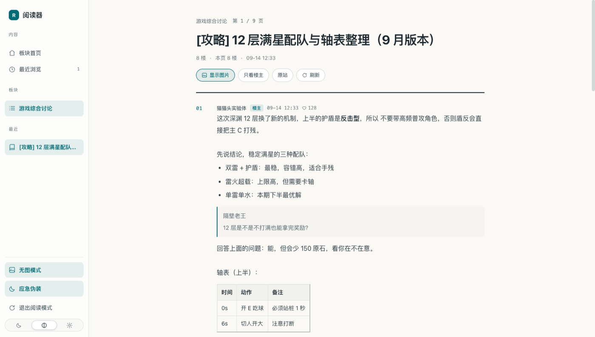

# NGA 阅读器

把 NGA 论坛（ngabbs.com / bbs.nga.cn）读成一份**资讯日报**：侧边栏导航 + 数字编号的楼层正文，暖白纸面、细线分隔、克制的青色强调。

设计语言参考 [aihot.news](https://aihot.news/daily) 的日报阅读页——那种「像在看一份内部资讯」而不是「像在逛论坛」的观感，正是办公场景下需要的。

> 零构建、零依赖，装法见下面「安装」。



> 上图是 `dev/` 样例页面在阅读模式下的实际渲染（真实 NGA 页面版式一致）。

## 特性

- **整站改写，不是换皮**：从 `document_start` 起接管页面，原站 HTML 只作为数据源，页面结构、字体、配色、间距全部由扩展渲染，原站 CSS/JS 不再参与显示。
  站内跳转仍是正常整页导航（NGA 的正文由它自己的 JS 注入，抓 HTML 拿不到），但原站从一开始就被藏住，所以看不到它闪一下。
- **阅读页（read.php）**：楼层按 `01 / 02 / 03 …` 编号排版，楼主标记、发帖时间、赞同数、引用块、嵌套引用、表格、代码块、折叠块全部保留；表情按原图大小行内显示，与大图区分开。
- **板块页（thread.php）**：主题列表带标签（置顶/精华/板块标签）、作者、时间、回复数、浏览量，分页用胶囊按钮。
- **首页（/）**：板块目录按分组平铺，鼠标悬停即可 ☆ 收藏到侧边栏。
- **无图模式**：默认不加载图片（摸鱼 + 省流量），正文里显示「图片」占位按钮，点一下即可全屏查看；**表情不受影响**，始终照常显示。
- **图片全屏预览**：正文里的图宽度贴齐正文栏、最大 70vh 高（长图不会占满一屏），点击进全屏：滚轮/± 缩放、拖动平移、
  同一层楼的图 ←/→ 切换、Esc 或点背景关闭。
- **一键显示图片**：会先唤醒 NGA 的懒加载（NGA 的图要滚进视口才真正加载），再重新排版，
  顺手过滤掉原站那些 1px 装饰图。
- **暗色模式**：深色 / 跟随系统 / 浅色三档，随系统自动切换。
- **应急伪装**：标签页换成中性图标与中性标题（默认「阅读器」，标题可在 popup 里改）；连按两下 `Esc` 立刻切到一份假的「项目进度」页面（再按 `Esc` `Esc` 切回）。
- **最近浏览 / 收藏板块**：存在 `chrome.storage.local`，popup 里可管理。
- **一键诊断**：解析不对时点侧边栏「复制诊断信息」（或兜底页上的「复制诊断」），会把 URL、DOM 选择器命中数、抽到的字段和第一楼 HTML 一起复制到剪贴板，直接发给维护者即可定位。

## 安装

1. 打开 `chrome://extensions/`（Edge 为 `edge://extensions/`）
2. 打开右上角「开发者模式」
3. 点「加载已解压的扩展程序」，选择本仓库的 **`extension/`** 目录
4. 打开 `https://ngabbs.com/`（需要先登录 NGA），页面会自动进入阅读模式

> 想先看看长什么样、又不想登录？扩展里附了一个离线演示页，装好后打开
> `chrome-extension://<扩展 ID>/demo/index.html`（在 `chrome://extensions/` 里能看到 ID）。

> 扩展在管理页里的名字是「NGA 阅读器」；但阅读时的标签页标题默认是中性的（`阅读器`），
> 加上中性图标与应急伪装页，旁边有人时也不至于一眼被看出在看论坛。

## 使用

| 快捷键 | 作用 |
| --- | --- |
| `Esc` `Esc` | 切换应急伪装页 |
| `i` | 无图模式开关 |
| `t` | 切换主题（浅色 → 深色 → 跟随系统） |
| `g` | 回到板块首页 |
| `r` | 刷新当前页 |
| `j` / `k` | 向下 / 向上滚动 |

点扩展图标可打开设置面板：总开关、无图模式、应急伪装、假页面快捷键、主题、标签页标题、正文字号、收藏板块、清空最近浏览。

> 「标签页标题」就是上面应急伪装用的那个中性标题（默认 `阅读器`），和侧边栏左上角的品牌名（固定为 `NGA 阅读器`）不是一回事。

需要回复/点赞时，点阅读页头部的「原站」按钮，会在原站打开同一页（可在 popup 里重新开启阅读模式）。

## 出问题时

1. **临时绕过**：popup 里关掉「阅读模式」；或在当前地址后面加 `?ngr=off`（本次会话都不再接管，回原站）。
2. **拿到现场**：点侧边栏「更多 → 复制诊断信息」（或兜底页上的「复制诊断」），
   会把 URL、DOM 选择器命中数、抽到的字段和第一楼 HTML 复制到剪贴板。
   直接提交 issue 时贴上这段文本，比截图有用得多。
3. **白屏**：说明“先藏后画”的标记没被摘掉，看看 DevTools Console 的第一条报错。

> 发帖时间、赞同数、图片懒加载、表情识别这几项都已经在登录态真机上实测确认（详见 [dev/nga-dom-notes.md](dev/nga-dom-notes.md)）；
> 还没做与想做的排在 [TODO.md](TODO.md)。

## 目录结构

```
nga-notion-fish/
├── extension/                   # Chrome 扩展（MV3，无构建、无依赖）
│   ├── manifest.json            # 名字 / 图标 / 权限 / content_scripts / popup
│   ├── src/
│   │   ├── boot.js              # 内容脚本入口：document_start 藏原站 → 动态 import 应用
│   │   ├── app.js               # 控制器：取页 → 解析 → 渲染 → 路由 / 快捷键 / 伪装 / 预览
│   │   ├── core/
│   │   │   ├── settings.js      # 设置与存储（chrome.storage，本地调试降级到 localStorage）
│   │   │   ├── diagnose.js      # 一键导出解析现场（排查用）
│   │   │   └── dom.js           # el()/icon() 等极简 DOM 工具
│   │   ├── nga/
│   │   │   ├── parse.js         # 【核心】NGA Document → 结构化模型（站点数据优先 + 选择器兜底）
│   │   │   ├── sanitize.js      # 【核心】正文克隆净化（引用/折叠/图片/表情/链接/表格）
│   │   │   └── lazy-images.js   # 唤醒 NGA 的图片懒加载（临时给原站布局 + 逐张滚进视口）
│   │   ├── view/                # 纯渲染层（shell / home / board / thread / parts / lightbox）
│   │   └── styles/              # boot.css + app.css（aihot 风格设计 token）
│   ├── icons/                   # 扩展图标（store/make-icons.py 生成）
│   ├── demo/                    # 离线演示页（给商店审核员 / 没登录的人看）
│   └── popup/                   # 扩展弹窗设置面板
├── dev/                         # 本地调试：假 NGA 页面 + 静态服务器 + DOM 结构笔记 + 参考脚本库
│   ├── README.md                # 调试方式与 fixtures 使用说明
│   ├── nga-dom-notes.md         # NGA 真实结构笔记（逐条带出处）
│   └── reference/               # 8 个第三方 NGA 用户脚本源码（仅供核对选择器）
├── store/                       # 上架素材：打包脚本、图标/宣传图生成、商品页文案（不参与扩展运行）
├── assets/                      # README 预览图
├── PRIVACY.md                   # 隐私政策（上架时填这个链接）
└── LICENSE                      # MIT
```

## 开发与调试

没有构建步骤，改完源码在 `chrome://extensions/` 里点一下「重新加载」即可。

没有 NGA 账号也能调 UI：`dev/` 下有一套结构仿真的样例页面。

```bash
python3 dev/server.py 8765
# 首页         http://127.0.0.1:8765/
# 板块页       http://127.0.0.1:8765/thread.php?fid=-7
# 阅读页       http://127.0.0.1:8765/read.php?tid=1234567
```

样例页面会以 `/dev/harness-boot.js` 代替 `boot.js` 启动同一套 `src/` 代码，所以在这里看到的排版就是扩展里的排版。样例页面还伪造了 NGA 自己的 `commonui.postArg` / `topicArg` / `__PAGE`，用来验证「优先读站点数据」这条路径；加上 `?nopostarg=1` 就能强制走选择器兜底路径：

```
http://127.0.0.1:8765/read.php?tid=1234567&nopostarg=1
```

真实 NGA 的 DOM 结构、以及这些选择器的来源脚本清单，整理在 [dev/nga-dom-notes.md](dev/nga-dom-notes.md)；调试方式与 fixtures 说明见 [dev/README.md](dev/README.md)。

调试时如果某个页面解析失败，会退化成一个「暂不支持 / 加载失败」的提示页，并给出「以原站方式打开」按钮——此时的界面就是排查解析问题的第一现场。

## 已知限制

- **必须登录**：NGA 对访客返回 `ERROR:15`，未登录时阅读模式会给出引导登录的提示页。
- **只读**：回复、点赞、私信等交互仍在原站完成。
- 解析依赖 NGA 现有 DOM 结构（`table.forumbox`、`[id^="post1strow"]`、`[id*="postcontent"]` 等），NGA 改版时可能需要调整 `extension/src/nga/parse.js` 里的选择器表。
- 目前覆盖首页 / 板块页 / 帖子页三类页面，搜索页、用户页等仍走原站。
- **图片**：NGA 的图要滚进视口才加载，所以「显示图片」时会先临时唤醒原站的懒加载；
  少数图（例如引用块里被原站裁掉的）拿不到地址，会留一个「图片（点击加载）」占位，点了没反应就说明催不出来。
  正文里的图宽度贴齐正文栏（原站会往图上写自己的 `max-width`，已被 `!important` 压住）；表情不走这套，永远按原图大小行内显示。
- **楼层号**：按每页 20 楼推算，还没在第 N 页（非首页）上核对过。

## License

MIT
